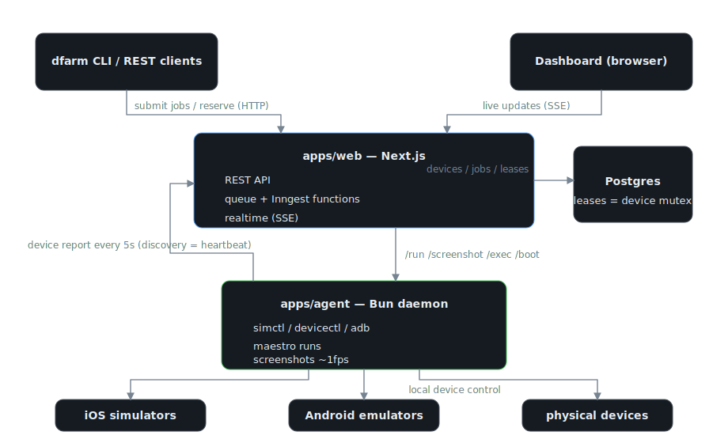

# device-farm

A shared orchestrator for the iOS simulators, Android emulators, and physical devices attached to this Mac. Every maestro flow and interactive device session goes through one queue, so coding agents and CI stop fighting over simulators — and when a device drops mid-run, the job is retried on another compatible device automatically.

- **Dashboard** — devices with ~1fps live screens, the queue, and run history with per-attempt timelines: http://localhost:3100
- **`dfarm` CLI** — drop-in replacement for `maestro test` in scripts and agents (`dfarm run flow.yaml --wait`)
- **REST API** — everything the CLI does, over HTTP (`DFARM_URL`)

Other projects: point your agents at [docs/using-dfarm.md](docs/using-dfarm.md).

## Quick start

```sh
mise install          # bun + node toolchains
bun install
mise run dev          # postgres + inngest (docker) + web on :3100 + device agent
```

Submit something:

```sh
bun run packages/cli/src/main.ts devices
bun run packages/cli/src/main.ts run my-flow.yaml --platform ios --wait
```

Build the standalone CLI binary: `mise run cli:build` → `packages/cli/dist/dfarm`.

## How it fits together



Scheduling is a single Postgres transaction (`FOR UPDATE SKIP LOCKED` + lease insert); Inngest retries around it. Disconnects are caught two ways: the agent notices a device vanished from discovery (~5s) and the server watchdog notices a dead agent via stale heartbeats (~60s). Either way the run is marked `device_lost`, the lease is released, and the job re-acquires a different device — booting a shutdown simulator if that's what it takes.

## Tasks

| task | what |
|---|---|
| `mise run dev` | dev infra + web + agent |
| `mise run e2e` | headless e2e (compose stack + stub agent); `mise run e2e -- cli/run-flow-and-wait` for one scenario |
| `mise run db:generate` / `db:migrate` | Drizzle migrations |
| `mise run typecheck` | all workspaces |
| `mise run boot` | start everything supervised (see ops below) |

## Running it permanently

`ops/` has both supervision options; pick one.

**pm2** (simplest):

```sh
pm2 start ops/pm2.config.cjs && pm2 save
```

**launchd** (survives reboots without pm2 startup hooks):

```sh
cp ops/launchd/*.plist ~/Library/LaunchAgents/
launchctl load ~/Library/LaunchAgents/rocks.shine.dfarm-*.plist
```

Both expect `mise` in PATH and run `mise run boot:infra` first so the compose infra is up.

## v1 boundaries

- **No auth.** Anyone on the network can see the dashboard and submit jobs. Auth becomes worth it the day the network stops being trusted — not before.
- Single Mac. The agent already talks to the server over HTTP, so a second Mac is "run another agent with a different `DFARM_AGENT_HOST`" plus content-addressed app uploads (today app binaries are host-local paths).
- Physical-iOS live view is best-effort (`idevicescreenshot` when available).
